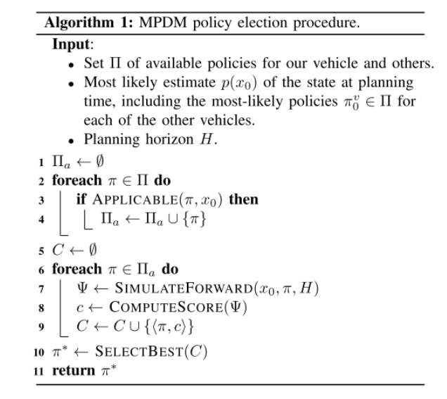

## 1 EPSILON学习资料
(1) EPSILON论文解读、代码ROS2-Carla重构、实车部署、落地交付全记录

> 链接：https://zhuanlan.zhihu.com/p/659942636

(2) MPDM

> 链接：https://mp.weixin.qq.com/s/_tJVwWoiPqgkLJoIyvaTOg

假设被控车辆和其他交通参与者在每个时间步长执行一组可行的闭环策略，该算法选择最佳可用策略供被控车辆执行。通过使用前向仿真模型来为被控车辆与其他智能体选取策略，有效地从他们相互作用的高可能性结果中采样。然后使用自定义的代价函数对不同的驾驶行为进行评分，并选择得分最高的策略。该论文在实车上验证了超车场景，在仿真平台上验证了**汇入场景**。

想想如何接入高速HWP的匝道汇入

MPDM对未来的不确定性具有鲁棒性，在离散决策层面通过连续的重新规划，在低级控制层面通过闭环策略模型，与模型预测控制技术类似，在较长时间范围内连续重新规划H，而只在较短时间内执行，使我们能够对不断变化的车辆行为做出反应。闭环策略模型在状态估计和执行中保证了对有界低阶不确定性的鲁棒性，因为策略可以适应局部扰动。

概述：该算法将一组候选策略Π、当前最可能的状态p(x0)和决策时域H作为输入。请注意，对环境状态的估计包括当前由其他智能体执行的最有可能的策略，在这项工作中，我们根据路网模型和其中智能体的姿态来确定。然后，该算法确定一组适用的策略给到当前状态，下一步是使用前向仿真模型，根据用户定义的代价函数对每个策略进行评分。在这一步中，对于每个适用的策略π，我们对系统在π下从状态x0开始的演化进行采样，以获得系统的状态序列Ψ = (x0, x1, . . . , xH), 其中，0 < t ≤ H，接下来，使用用户定义的代价函数对序列Ψ进行评分。得到的分数c被添加到分数C的集合中。最后，返回与c中最高分相关的最优策略π *。

汇入场景强调了如何用闭环策略模拟所有汽车的前进，使我们的系统能够考虑到我们的行为对其他驾驶员的反应。

(3) 实际测试环境效果
> 链接：https://www.zhihu.com/zvideo/1438258777556955136

智能发现间隙与合并
交互感知超车
密集交通中的低速自动换道
切入操纵和自动换道
密集交通中的自动合并
驾驶员触发的换道
低速交互感知车道变换

(4) 自动驾驶感知工程师规划速成课程
> 链接：https://zhuanlan.zhihu.com/p/1963203633714828480

MPDM将POMDP简化为对有限、离散的语义级策略集合进行闭环前向仿真，而不是为每辆车评估所有可能的控制输入。解决了维度灾难问题，实现了有效实时决策

MPDM 及其所有后续工作可能的一个缺点是，它们依赖于为类似高速公路结构的环境设计的简单策略，例如车道保持和变道。这种依赖可能限制了前向仿真在处理复杂交互时的能力。为了解决这个问题，跟随 MPDM 的例子，使 POMDPs 更有效的关键是通过高层次策略树的扩展来简化动作和状态空间。通过列举所有相对物体的时空相对位置标签，然后执行引导分支，可能能够创建一个更灵活的策略树。

增加匝道车道并连接到主路，设置自车id=0起点，需要面临匝道汇入的场景，还有其他id车的位置

如何定义这个横向行为Nudge：轻微绕障回到原车道
这个本身车道和车道保持所在ID一样，如何去触发这个行为
